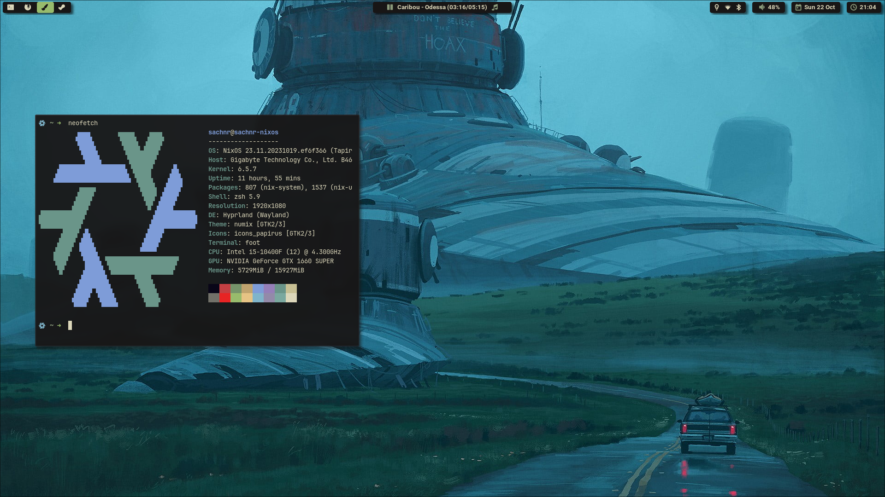

# Dotfiles



## Instructions for Future Reference

### Templates

```
nix flake init --template github:sachnr/dotfiles#rust
```

### Nixos install

- `nixos-generate-config --root /mnt`

- enable flakes

  - in _`configuration.nix`_ add
    ```nix
    nix.settings.experimental-features = [ "nix-command" "flakes" ];
    ```
  - `# nixos-rebuild switch`

- `# nixos-rebuild switch --flake github:sachnr/dotfiles#desktop`
